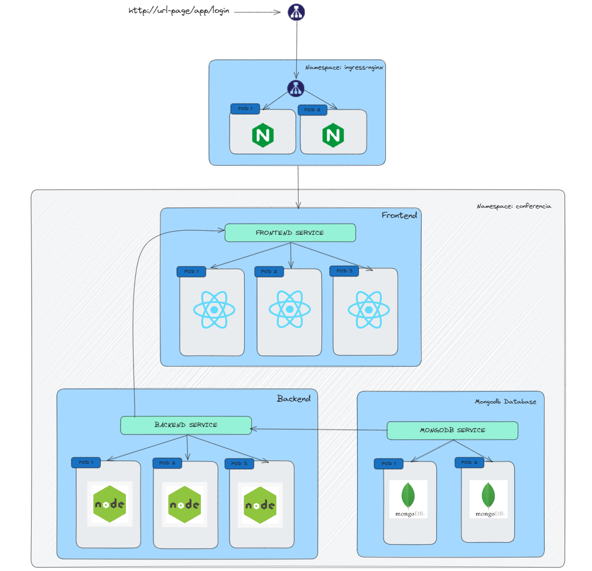
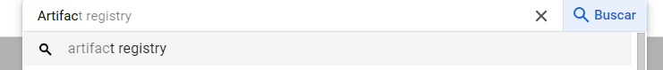
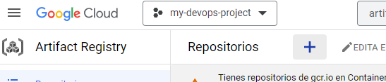
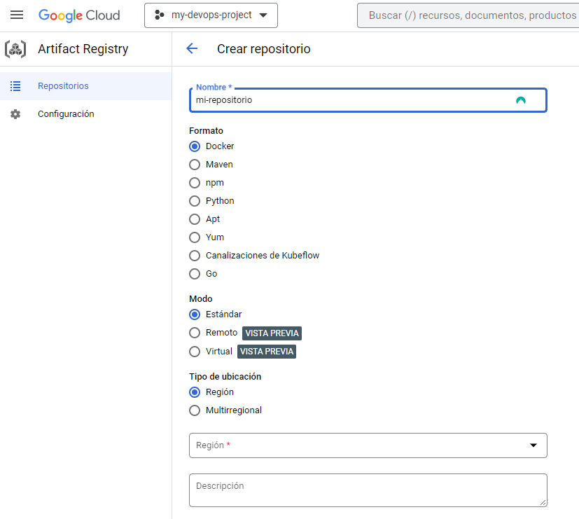
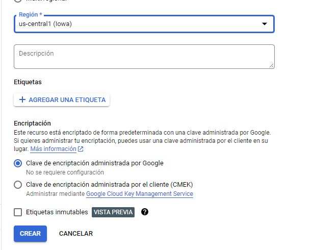
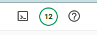
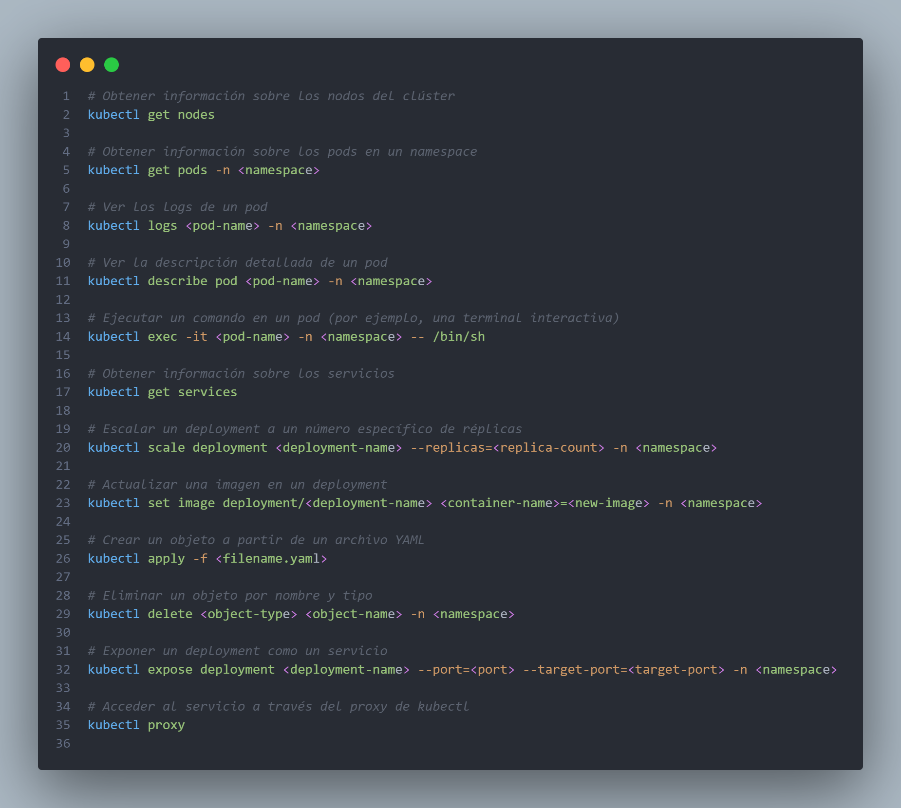

# Orquestación de Contenedores con Kubernetes

- [Orquestación de Contenedores con Kubernetes](#orquestación-de-contenedores-con-kubernetes)
  - [:white\_check\_mark:  Pasos para realizar Ejemplo practico](#white_check_mark--pasos-para-realizar-ejemplo-practico)
    - [Herramientas y plataformas utilizadas:](#herramientas-y-plataformas-utilizadas)
    - [Arquitectura de las aplicaciones](#arquitectura-de-las-aplicaciones)
    - [Aspectos importantes a tomar en cuenta](#aspectos-importantes-a-tomar-en-cuenta)
  - [:white\_check\_mark:  Dockerizar aplicaciones](#white_check_mark--dockerizar-aplicaciones)
    - [¿Qué es artifact registry?](#qué-es-artifact-registry)
    - [Crear Repositorio en Artifact Registry](#crear-repositorio-en-artifact-registry)
    - [Subir imagen de Backend](#subir-imagen-de-backend)
    - [Subir imagen de Frontend](#subir-imagen-de-frontend)
  - [:white\_check\_mark:  Crear cluster de Kubernetes en Google Cloud Platform](#white_check_mark--crear-cluster-de-kubernetes-en-google-cloud-platform)
  - [:white\_check\_mark: Orquestrar contenedores en Kubernetes](#white_check_mark-orquestrar-contenedores-en-kubernetes)
    - [Base de datos](#base-de-datos)
    - [Backend](#backend)
    - [Frontend](#frontend)
      - [Instalación de Nginx Ingress Controller](#instalación-de-nginx-ingress-controller)
  - [Comandos utiles](#comandos-utiles)


## :white_check_mark:  Pasos para realizar Ejemplo practico

### Herramientas y plataformas utilizadas:

* Google Cloud Platform
* Linux (opcional)
* Docker
* Linea de comandos de Google Cloud (gcloud)
* Linea de comandos de Kubectl

### Arquitectura de las aplicaciones



### Aspectos importantes a tomar en cuenta

Para poder realizar el ejemplo practico en Google Cloud Platform sin incurrir en gastos adicionales, se recomienda utilizar los $300.00 dolares que otorga Google Cloud como regalo al crear una nueva cuenta.

## :white_check_mark:  Dockerizar aplicaciones

En este paso las aplicaciones tanto de backend y frontend serán dockerizadas y subidas a un registro de Google Cloud Platform, que en este caso será **Artifact Registry**.

### ¿Qué es artifact registry?

Google Artifact Registry es un servicio de administración y almacenamiento de artefactos de software que permite a los desarrolladores almacenar, administrar y distribuir imágenes de contenedores y paquetes de software en un registro privado seguro. Proporciona una solución integrada y escalable para almacenar y organizar activos como imágenes de Docker, paquetes de sistema y bibliotecas de código, lo que facilita el desarrollo, la implementación y la colaboración en proyectos de software.

Como alternativa, también existe **Container Registry** de Google , el cual no se recomienda utilizarlo debido a que ya está obsoleto.

### Crear Repositorio en Artifact Registry

1. Buscar el servicio Artifact Registry en la consola de Google Cloud Platform.



2. Clic en el icono para crear nuevo repositorio.



3. Nombrar el repositorio, su tipo y la región en la cual estará ubicado.



4. Crear el repositorio




### Subir imagen de Backend


1. Generar build en Docker 

    ```
    docker build -t chat_backend .
    ```
2. Etiquetar y subir al registro

    ### Alternativa 1: Utilizando Artifact Registry

    ```Docker
    docker tag chat_backend us-central1-docker.pkg.dev/my-devops-project-392822/conferencia/chat_backend:latest
    ```

    ```
    docker push us-central1-docker.pkg.dev/my-devops-project-392822/conferencia/chat_backend:v3
    ```

    ### Alternativa 2: Container Container Registry

    ```
    docker tag ticket_server gcr.io/my-devops-project-392822/ejemplo/server:latest
    ```

    ```
    docker push gcr.io/my-devops-project-392822/ejemplo/server:latest
    ```


### Subir imagen de Frontend


1. Generar build en Docker 

    ```
    docker build -t chat_frontend .
    ```
2. Etiquetar y subir al registro

    ### Alternativa 1: Utilizando Artifact Registry

    ```Docker
    docker tag chat_frontend us-central1-docker.pkg.dev/my-devops-project-392822/conferencia/chatfrontend:latest
    ```

    ```
    docker push us-central1-docker.pkg.dev/my-devops-project-392822/conferencia/chatfrontend:latest
    ```

    ### Alternativa 2: Container Container Registry

    ```
    docker tag ticket_server gcr.io/my-devops-project-392822/ejemplo/server:latest
    ```

    ```
    docker push gcr.io/my-devops-project-392822/ejemplo/server:latest
    ```


## :white_check_mark:  Crear cluster de Kubernetes en Google Cloud Platform

1. En la parte superior derecha de la pantalla seleccionar el icono de la terminal que está integrada en Google Cloud Plarform

    


2. Una vez abiera la terminal de GCP, ingresar el siguiente comando 

    ```sh
    gcloud container clusters create cluster-de-ejemplo \
        --num-nodes=2 \
        --machine-type=n1-standard-1 \
            --zone=us-central1-a
        --preemptible
    ```

    El comando anterior creará un cluster con las siguientes caracteristicas:

    * Nombre del clúster: cluster-de-ejemplo
    * Número de nodos: 2
    * Tipo de máquina: n1-standard-1
    * Zona: us-central1-a
    * Preemptible: Sí (se están utilizando nodos preemptibles)


    ### :warning: Importante tomar en cuenta: 
    * Para evitar incurrir en gastos adicionales, se recomienda crear un cluster zonal debiado a que los clústeres zonales tienden a ser más económicos pero con una menor alta disponibilidad, mientras que los clústeres regionales son más costosos pero ofrecen una alta disponibilidad superior. La elección entre ellos debe basarse en los requisitos de disponibilidad, capacidad financiera y otros factores relevantes para tu aplicación y cargas de trabajo.
    Por efecto se utilizar un cluster zonal.

    La creación del cluster puede tomar varios minutos.

3. Conectar a Kubectl (desde entorno local)

    Luego de crear el cluster de Kubernetes, se procede a conectar el cluster a la linea de comandos de Kubectl.

    * Actualizar zona con la que se está trabajando

    ```sh
    GCP_ZONE=us-east1-b
    ```

    ```sh
    gcloud config set compute/zone $GCP_ZONE
    ```
  
    * Obtener credenciales de cluster

    ```
    gcloud container clusters get-credentials cluster-de-ejemplo
    ```


## :white_check_mark: Orquestrar contenedores en Kubernetes


### Base de datos
1. Crear deployment

    ```yaml
        apiVersion: apps/v1
    kind: Deployment
    metadata:
    name: mongodb-deployment
    namespace: conferencia
    spec:
    replicas: 2
    selector:
        matchLabels:
        app: mongodb
    template:
        metadata:
        labels:
            app: mongodb
        spec:
        containers:
            - name: mongodb
            image: mongo:latest
            ports:
                - containerPort: 27017
    ```

2. Crear servicio

    ```yaml
    apiVersion: v1
    kind: Service
    metadata:
    name: mongodb-service
    namespace: conferencia
    spec:
    type: ClusterIP  # Puedes usar LoadBalancer si estás en un entorno compatible
    ports:
        - port: 27017
        targetPort: 27017
    selector:
        app: mongodb

    ```

### Backend

1. Crear deployment

    ```yaml
    apiVersion: apps/v1
    kind: Deployment
    metadata:
    name: chatappserver
    namespace: conferencia
    labels:
        app: chatappserver
    spec:
    replicas: 3
    selector:
        matchLabels:
        app: chatappserver
    template:
        metadata:
        labels:
            app: chatappserver
        spec:
        containers:
            - name: chatappserver
            image: us-central1-docker.pkg.dev/my-devops-project-392822/conferencia/chat_backend:v3

            ports:
                - containerPort: 8080
            env:
                - name: PORT
                value: "8080"
                - name: DB_CNN_STRING
                value: "mongodb://10.100.6.196:27017/chatdb"
                - name: JWT_KEY
                value: "p@l4Br4zzz3kr3ttttta"
    ```

2. Crear servicio

    ```yaml
    apiVersion: v1
    kind: Service
    metadata:
    name: chatappserver-svc
    namespace: conferencia
    spec:
    selector:
        app: chatappserver
    ports:
        - protocol: TCP
        port: 8080
        targetPort: 8080
    ```


### Frontend
1. Crear deployment

    ```yaml
    apiVersion: apps/v1
    kind: Deployment
    metadata:
    name: chatappfrontend
    namespace: conferencia
    labels:
        app: chatappfrontend
    spec:
    replicas: 3
    selector:
        matchLabels:
        app: chatappfrontend
    template:
        metadata:
        labels:
            app: chatappfrontend
        spec:
        containers:
            - name: chatappfrontend
            image: us-central1-docker.pkg.dev/my-devops-project-392822/conferencia/chatfrontend:v4 

            ports:
                - containerPort: 80

    ```

2. Crear servicio


    ```yaml
    apiVersion: v1
    kind: Service
    metadata:
    name: chatappfrontend-svc
    namespace: conferencia
    spec:
    selector:
        app: chatappfrontend
    ports:
        - protocol: TCP
        port: 80
        targetPort: 80
    # type: ClusterIP
    ```

3. Instalación de NGINX Ingress Controller

El controlador de ingreso Nginx para Kubernetes es un componente de software diseñado para facilitar y gestionar el enrutamiento del tráfico de red entrante hacia los servicios dentro de un clúster de Kubernetes. Actúa como un punto de entrada externo que permite la exposición de servicios de la aplicación a través de reglas de enrutamiento basadas en nombres de host, rutas y otros atributos.

Este controlador de ingreso utiliza el servidor web Nginx para gestionar las solicitudes entrantes y dirigirlas hacia los servicios adecuados en función de las reglas de configuración definidas. Proporciona características como balanceo de carga, redirecciones, reescritura de URL y soporte para la terminación SSL/TLS.

#### Instalación de Nginx Ingress Controller

  * Crear un namespace

    ```sh
    kubectl create namespace nginx-ingress
    ```

  * Desplegar Nginx Controller

    ```sh
    kubectl apply -f https://raw.githubusercontent.com/kubernetes/ingress-nginx/master/deploy/static/provider/cloud/deploy.yaml
    ``` 

4. Crear Ingress para frontend


    ```yaml
    apiVersion: networking.k8s.io/v1
    kind: Ingress
    metadata:
    name: chatapp-frontend-ingress
    namespace: conferencia
    annotations:
        kubernetes.io/ingress.name: "nginx"

    spec:
    rules:
        - host: ""
        http:
            paths:
            - pathType: ImplementationSpecific
                path: /
                backend:
                service:
                    name: chatappfrontend-svc
                    port:
                    number: 80

    ```

## Comandos utiles

